# Awesome Public Health Surveillance 🌐 🦠 🏥



<p align="center">
  <a href="https://github.com/ishandutta2007/Awesome-Awesome-Awesome"></a><a href="https://discord.gg/jc4xtF58Ve"></a>
  
  
  <a href="https://github.com/ishandutta2007"></a>
</p>

## 📌 Top Public Health Surveillance Platforms Ecosystem 🔬

**Curated List of SaaS Products, Hosted Platforms & Open-Source GitHub Projects**

*Focused on Disease Surveillance, Epidemic Intelligence, Outbreak Response, Contact Tracing, Case Management & Health Data Systems (HMIS)*

📅 **Last updated:** September 2026

---

### 💡 Overview & Scope

This repository tracks premier **SaaS/hosted platforms** and **open-source projects** for **Public Health Surveillance**, epidemiology, and disease modeling. These systems support indicator- and event-based surveillance, rapid outbreak detection and response, contact tracing, case management, and national or regional health data reporting.

- 🏆 **Key Platforms Include:** Esri ArcGIS, Dimagi CommCare, BlueDot, OpenMRS, ODK (Open Data Kit), KoboToolbox, SORMAS, DHIS2, WHO Go.Data, and CDC Epi Info.
- 🔓 **Open-Source Dominance:** Public health surveillance features one of the strongest open-source software ecosystems globally. **DHIS2**, **SORMAS**, **OpenMRS**, **ODK**, and **Go.Data** serve as national health management backbones across dozens of ministries of health and international health organizations (WHO, CDC, Africa CDC).

🤝 **Contributions Welcome!** Feel free to open a Pull Request to suggest new tools or update existing details.

---

## 📑 Table of Contents

- [🏢 SaaS & Commercial Hosted Platforms](#-saas--commercial-hosted-platforms)
- [🔓 Open-Source GitHub Projects](#-open-source-github-projects)
- [🛠️ Architecture & Deployment Guide](#%EF%B8%8F-architecture--deployment-guide)
- [🤝 How to Contribute](#-how-to-contribute)
- [⚠️ Disclaimer](#%EF%B8%8F-disclaimer)
- [🌟 Star History](#-star-history)

---

## 🏢 SaaS & Commercial Hosted Platforms

### 📊 Industry Market Size & Ecosystem Dynamics
> **Estimated Global Public Health Technology & Surveillance Market Size:** **$14.2 Billion – $18.5 Billion** (incorporating health intelligence SaaS, digital HMIS software, geospatial epidemiology suites, and commercial disease surveillance analytics).  
> **Market Structure:** **Highly Fragmented**. The sector comprises large enterprise GIS incumbents (Esri), specialized epidemic intelligence SaaS vendors (BlueDot), mobile data platforms (Dimagi CommCare), alongside widely deployed open-source systems maintained by non-profit foundations and university centers (HISP/DHIS2, SORMAS Foundation). No single "winner-take-all" vendor dominates every layer of field data collection, clinical EMR, and national HMIS reporting.

*Table sorted in descending order by company scale (Est. Enterprise Valuation / Annual Revenue).*

| Product | Description | Company Size (Valuation / Revenue) 📈 | Pricing 💳 | Free Tier Limits 🎁 |
| :--- | :--- | :--- | :--- | :--- |
| **[ArcGIS Survey123](https://www.esri.com/en-us/arcgis/products/arcgis-survey123/overview)** 🗺️ | Esri's form-based field data collection tool integrated with GIS surveillance & spatial outbreak analytics. | **~$12 Billion+** valuation / ~$1.5B annual revenue (Esri) | Included with ArcGIS Online Creator user license ($700 - $850/year per user) | 21-day free trial of ArcGIS Online (includes 2 Creator licenses and 400 service credits) |
| **[REDCap](https://projectredcap.org/)** 📊 | Secure web application for building online surveys and clinical research databases used in public health. | **~$1 Billion+** institutional backing (Vanderbilt Univ & global consortium of 6,800+ institutions) | Free to non-profit institutional partners ($0 license; optional commercial hosting) | Unlimited free access for licensed non-profit/academic partner institutions (7-day demo trial available) |
| **[CommCare](https://www.dimagi.com/commcare/)** 📱 | Mobile-first data collection & case management platform with offline capabilities for health workers. | **~$50 Million - $100 Million** valuation / ~$15M - $25M annual revenue (Dimagi) | Standard plan starts at $100/month (billed annually) or $120/month (billed monthly) | Free Edition available (strictly limited to testing/piloting projects with up to 5 mobile users) |
| **[BlueDot](https://bluedot.global/)** 🌐 | Global infectious disease intelligence platform for early warning, risk assessment, and outbreak tracking. | **~$30 Million - $60 Million** valuation (backed by federal grants & venture capital) | Commercial Enterprise subscription (custom quotes; annual government contracts typically $50,000 - $500,000+) | Demo trial available upon request for qualified public health/enterprise organizations; no permanent free plan |
| **[OpenMRS](https://openmrs.org/)** 🏥 | Electronic medical record platform integrated with public health surveillance and clinical data flows. | **~$20 Million+** global community funding (supported by Regenstrief, Rockefeller Foundation) | Free & open-source ($0 core software; commercial partner hosting/support varies) | Unlimited free usage (100% free open-source core platform for self-hosting with no limits) |
| **[DHIS2](https://www.dhis2.org/)** 🌍 | Dominant health management information system (HMIS) for national & regional surveillance reporting. | **~$20 Million+** annual grant funding (UiO / HISP network supported by NORAD, PEPFAR, Global Fund) | Free & open-source ($0 core platform; optional enterprise hosting starting ~$500/month) | Unlimited free usage (100% free open-source core with no limit on records or users) |
| **[SORMAS](https://www.sormas.org/)** 🦠 | Surveillance Outbreak Response Management and Analysis System for epidemic preparedness & contact tracing. | **~$10 Million+** institutional ecosystem (SORMAS Foundation, HZI, GIZ, BMZ) | Free & open-source ($0 core software; optional paid hosting/support from €500/month) | Unlimited free usage (100% free open-source core for self-hosting with unrestricted case/user limits) |
| **[AIMS Platform](https://www.aimsplatform.com/)** 📡 | Cloud-based surveillance data exchange hub and situational awareness analytics platform for public health agencies. | **~$10 Million+** institutional platform (Association of Public Health Laboratories - APHL & CDC) | Commercial SaaS / Enterprise quote (Custom agency contracts) | Free pilot / demonstration available upon organizational request; no permanent free plan |
| **[Go.Data](https://www.who.int/tools/godata)** 🩺 | WHO outbreak investigation and contact-tracing application supporting transmission chain modeling. | **Global UN/WHO Project** (World Health Organization & GOARN partner network) | Free & open-source ($0 / community-supported by WHO) | Unlimited free usage (100% free public platform provided by WHO with no usage limits) |
| **[Epi Info](https://www.cdc.gov/epiinfo/index.html)** 📈 | CDC public-domain software suite for epidemiologic data collection, statistical analysis, and mapping. | **US Federal Agency Project** (United States Centers for Disease Control and Prevention - CDC) | Free public domain ($0 provided by US CDC) | Unlimited free usage (100% free public domain suite with no limits) |

---

## 🔓 Open-Source GitHub Projects

*Sorted in descending order by GitHub Star count.*

| Repository | Stars ⭐ | Description | Key Capabilities |
| :--- | :--- | :--- | :--- |
| **[openmrs/openmrs-core](https://github.com/openmrs/openmrs-core/stargazers)** 🏥 | [](https://github.com/openmrs/openmrs-core/stargazers) | Open-source electronic medical record system platform core used globally in public health clinics. | Patient EMR, clinical workflows, REST API, surveillance integration |
| **[getodk/collect](https://github.com/getodk/collect/stargazers)** 📱 | [](https://github.com/getodk/collect/stargazers) | Open Data Kit (ODK) Collect — Android app for mobile survey data collection in offline field environments. | Offline form entry, GPS mapping, photo/audio capture, ODK Aggregate/Central sync |
| **[dhis2/dhis2-core](https://github.com/dhis2/dhis2-core/stargazers)** 🌍 | [](https://github.com/dhis2/dhis2-core/stargazers) | District Health Information Software 2 (DHIS2) — standard national HMIS backend used in 70+ countries. | Aggregated & tracker surveillance, GIS mapping, analytics dashboards |
| **[SORMAS-Foundation/SORMAS-Project](https://github.com/SORMAS-Foundation/SORMAS-Project/stargazers)** 🦠 | [](https://github.com/SORMAS-Foundation/SORMAS-Project/stargazers) | Surveillance Outbreak Response Management and Analysis System for disease control & epidemic response. | Case management, contact tracing, disease outbreak alerts, mobile sync |
| **[kobotoolbox/kpi](https://github.com/kobotoolbox/kpi/stargazers)** 📋 | [](https://github.com/kobotoolbox/kpi/stargazers) | KoboToolbox primary web interface and API service for field data collection in humanitarian emergencies. | Survey design, form builder, team data collection, GIS visualizer |
| **[WorldHealthOrganization/godata](https://github.com/WorldHealthOrganization/godata/stargazers)** 🩺 | [](https://github.com/WorldHealthOrganization/godata/stargazers) | WHO Go.Data outbreak investigation tool for contact follow-up and transmission chain visualization. | Contact tracing, case investigation, contact follow-up, outbreak networks |
| **[dimagi/commcare-hq](https://github.com/dimagi/commcare-hq/stargazers)** 💻 | [](https://github.com/dimagi/commcare-hq/stargazers) | Backend web application for CommCare mobile field workforce & case management platform. | Form builder, decision support, case management API, messaging |
| **[SORMAS-Foundation/SORMAS-DHIS2-2Way-Adapter](https://github.com/SORMAS-Foundation/SORMAS-DHIS2-2Way-Adapter/stargazers)** 🔄 | [](https://github.com/SORMAS-Foundation/SORMAS-DHIS2-2Way-Adapter/stargazers) | Bidirectional interoperability connector enabling seamless data exchange between SORMAS and DHIS2. | Automated sync, data transformation, multi-system integration |

---

## 🛠️ Architecture & Deployment Guide

```
+-----------------------------------------------------------------------+
|                 Routine & National HMIS Backbone                       |
|                          (DHIS2 Core)                                 |
+-----------------------------------+-----------------------------------+
                                    |
            +-----------------------+-----------------------+
            |                                               |
+-----------v-----------+                       +-----------v-----------+
| Outbreak Response &   |                       |  Clinical EMR & Field |
|   Contact Tracing     |                       |    Data Collection    |
| (SORMAS / Go.Data)    |<=====================>|  (OpenMRS / ODK /     |
+-----------------------+   Interoperability    |    KoboToolbox)       |
                                Adapters         +-----------------------+
```

### Recommended Public Health Tech Stack 🏛️
1. **National Routine Surveillance:** Deploy **DHIS2** for routine aggregate case reporting and regional HMIS dashboards.
2. **Epidemic Outbreak Response:** Deploy **SORMAS** or **Go.Data** during active disease outbreaks for rapid case investigations and contact tracing.
3. **Field Data Collection & Surveys:** Utilize **ODK (Open Data Kit)**, **KoboToolbox**, or **ArcGIS Survey123** for mobile field surveys with full offline support.
4. **Clinical Data Integration:** Connect facility-level EMRs via **OpenMRS** to feed real-time clinical indicator data into central surveillance backends.

---

## 🤝 How to Contribute

Contributions are welcome! Please follow these simple guidelines:

1. **Fork** the repository.
2. Add or update entries in `README.md` using the markdown table formats.
3. Ensure links, company valuations, starting prices, and Stars_Badges remain factual and accurately formatted.
4. Open a **Pull Request** with a brief explanation of your additions.

⭐ *If you find this public health surveillance ecosystem list useful, please star the repository!*

---

## ⚠️ Disclaimer

- This repository is a **community-curated index** for informational and educational purposes.
- Public health surveillance systems handle highly sensitive Personal Health Information (PHI). All software deployments must adhere to national data protection regulations (GDPR, HIPAA, etc.), health governance standards, and ethical guidelines.

---

## 🌟 Star History

[](https://star-history.dera.page/#ishandutta2007/Awesome-Public-Health-Surveillance&type=date&legend=top-left)

---

<p align="center">
  <b>Built for Ministries of Health, Public Health Agencies, NGOs, and Epidemiologists worldwide.</b><br/>
  <i>Keeping global disease surveillance open, transparent, and outbreak-ready.</i>
</p>
